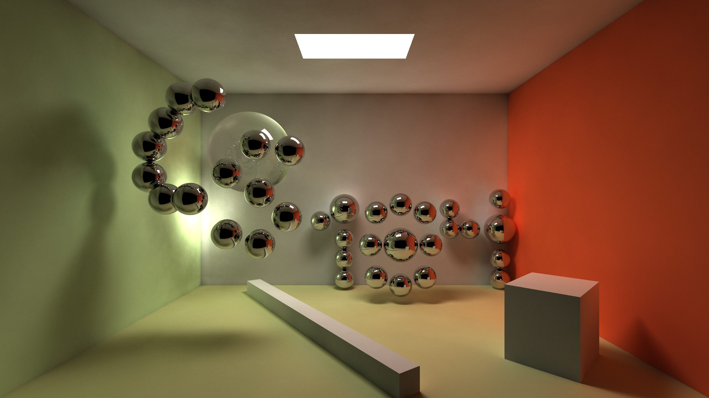
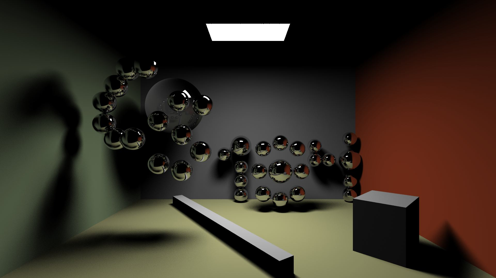
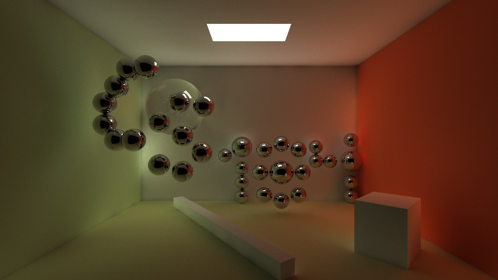
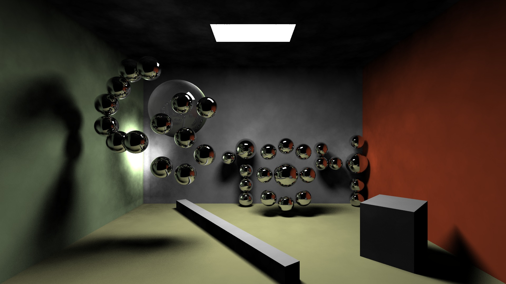
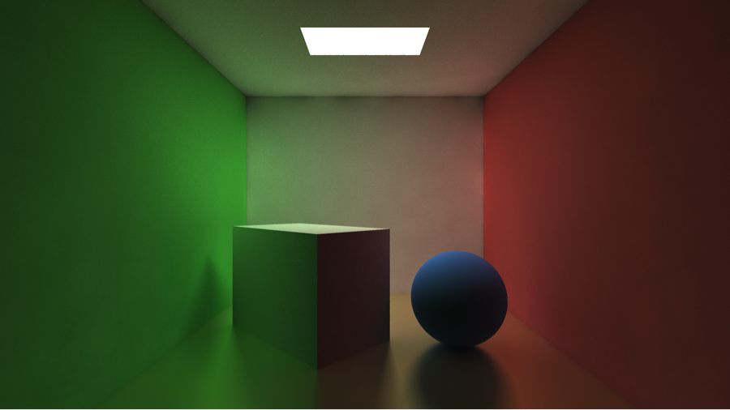

Global Illumination
200k Photons, 20k Caustic Photons, 150 Final Gather Rays
 

The global illumination effect consists of three parts: **direct illumination**, **indirect illumination**, and **caustic**.

For the indirect illumination part, we use **final gathering on photon mapping**. Unlike regular path tracer, we perform final gathering on the irradiance estimate from photon map. Thus, the running time is faster than ordinary ray tracer, and the noise of the resulted image is greatly reduced.

We use [Professor Jensen](http://graphics.ucsd.edu/~henrik/)'s implementation of [k-d tree](http://graphics.ucsd.edu/courses/cse168_s06/ucsd/photonmap.cc) structure to store our photon map. One thing worth noting is that a photon's direction is encoded by 2 char variables, which could represent 65536 different directions. This implementation ensures accuracy and decreases space complexity-each photon only takes 20 bytes to store.

We use rejection sampling to emit photons to ensure the intensity of square area light is proportional to the cosine value of the angle between the emitting direction and the normal of the square area light.

While simulating the scattering and absorbing of photons, we have used Russian Roulette method to ensure photon's power not to be too small and all photons have similar energies. Thus, the irradiance estimate would be more accurate and the amount of photons would not grow exponentially.

We process the final gathering step on the hemisphere of the interacted surface. However, if the interacted point were near wall edge or corner, there would be obvious bias. 

We solved this problem by dynamically control the number of final gather ray-that if the interacted point of the final gather ray is with in a certain distance of the original interacted point, we will send out second final gather ray instead of doing irradiance estimate. Then, the number of final gathering ray would be dynamically increased to ensure a precise irradiance estimate.

Below are some sample images we generated.

Direct illumination
100 Soft Shadow Rays
 

Indirect Illumination (Multiple Diffuse Reflections)
200k Photons, 150 Final Gather Rays
 

Direct Illumination + Caustics
200k Photons, 20k Caustic Photons
 

Special Effect-Glossy Surface

**Our renderer could also take serialized data in .obj format from our <a href="/project/clothsim/">cloth simulator</a>, which is another part of this dual project.**

Here are two videos showing rendered cloth simulation videos.
<iframe width="100%" height="400" src="http://www.youtube.com/embed/vHHDwwqTLlc?vq=hd720&rel=0&theme=light" frameborder="0"></iframe>
*Breeze*

<iframe width="100%" height="400" src="http://www.youtube.com/embed/IsyFa5dMyHM?vq=hd720&rel=0&theme=light" frameborder="0"></iframe>
*Gravity*

One final note, except [AABB](http://kreationsedge.net/?page_id=27) acceleration data structure, we also use [OpenMP](http://openmp.org/wp/) to accelerate rendering, and this technique works 
quite well on the departments' [hive machines](http://inst.eecs.berkeley.edu/cgi-bin/clients.cgi?choice=330soda).

**Acknowledgments**:
During the development of this project, we are instructed by Professor [James O'Brien](http://www.cs.berkeley.edu/~job/Prof._James_F._OBrien/Home.html) and our GSI [Jiamin Bai](http://www.eecs.berkeley.edu/~bjiamin/About%20Me.html) and [Brandon Wang](http://brandonwang.net/). We have also gained instructions from Professor [Henrik Wann Jensen](http://graphics.ucsd.edu/~henrik/)'s [_Practical Guide to Global Illumination_](http://graphics.stanford.edu/courses/cs348b-00/course8.pdf), Doctor Frank Suykens's [_On robust Monte Carlo algorithms for multi-pass global illumination_](http://graphics.cs.kuleuven.be/publications/phdSuykens/), and Zack Waters's [_Report on Photon Mapping_](http://web.cs.wpi.edu/~emmanuel/courses/cs563/write_ups/zackw/photon_mapping/PhotonMapping.html).
